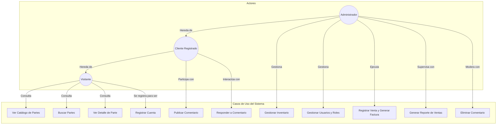
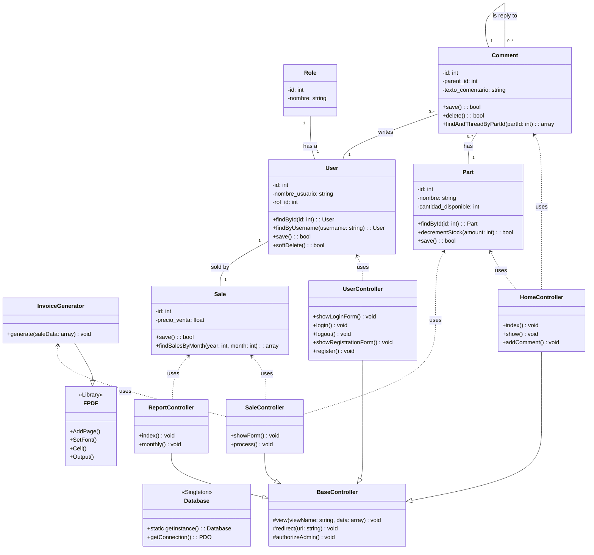
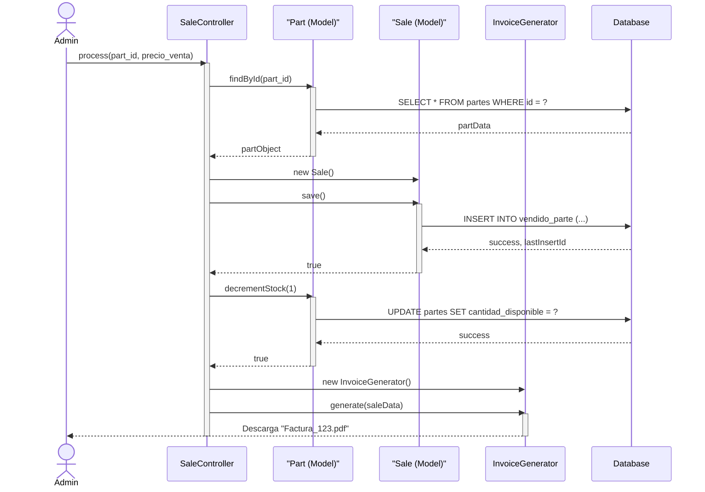

# Documentación del Proyecto: Sistema de Inventario o Rastro

**Versión:** 2.0
**Fecha:** 09 de Diciembre de 2025
**Autor:** Asistente Gemini (Arquitecto de Software)

---

## 1. Introducción

Este documento detalla la arquitectura, diseño y requisitos del "Sistema de Inventario o Rastro". El objetivo es construir una aplicación web modular y robusta utilizando PHP nativo y el patrón MVC. La versión actual incluye un sistema de inventario funcional, gestión de usuarios con diferentes roles, un portal público de catálogo, un sistema de comentarios anidados y generación de reportes de ventas en PDF.

---

## 2. Arquitectura del Sistema

-   **Patrón de Diseño:** Modelo-Vista-Controlador (MVC).
-   **Enfoque de Programación:** Orientada a Objetos (POO) con tipado estricto de PHP 8.
-   **Estructura de Archivos:** El sistema se organiza en carpetas dedicadas para `public` (front-controller), `src` (lógica de negocio), `views` (plantillas), `config` (conexión a BD), `database` (scripts SQL) y `libs` (dependencias de terceros como FPDF).

---

## 3. Diagramas UML

### 3.1. Diagrama de Casos de Uso

El siguiente diagrama ilustra las interacciones de los actores con las funcionalidades principales del sistema.

**Descripción de Actores:**
-   **Visitante:** Usuario anónimo. Puede navegar el catálogo y registrarse.
-   **Cliente Registrado:** Usuario con cuenta. Puede comentar y responder.
-   **Administrador:** Usuario con privilegios totales, incluyendo gestión de inventario, usuarios y ventas.

### 3.2. Diagrama de Clases

Este diagrama detalla la estructura estática del sistema en su estado actual.

### 3.3. Diagrama de Secuencia: Registrar Venta

Este diagrama muestra el flujo actualizado para registrar una venta, que ahora incluye la generación de una factura en PDF.

