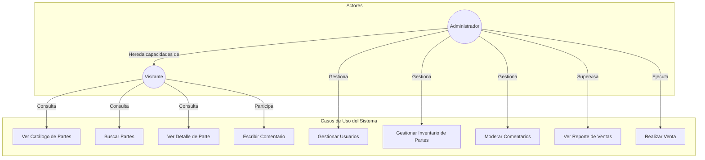
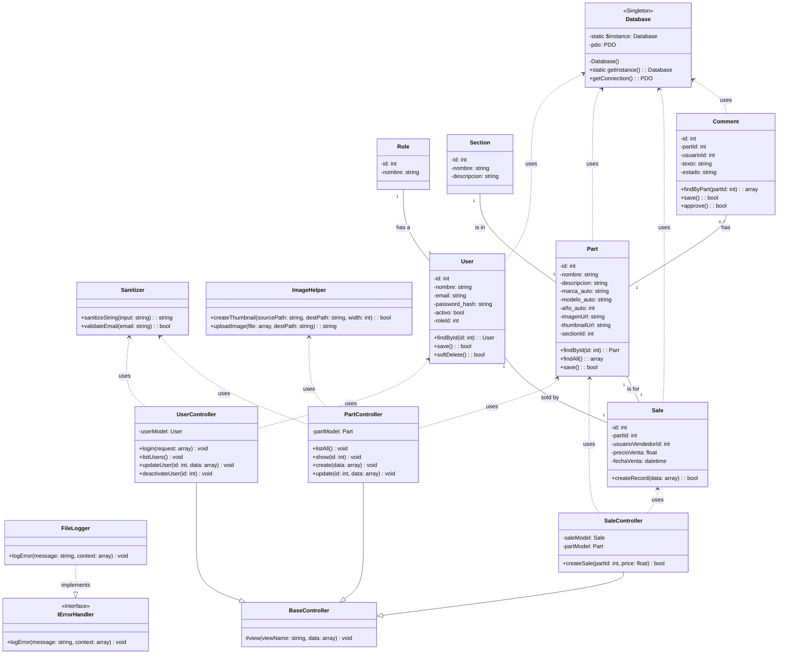
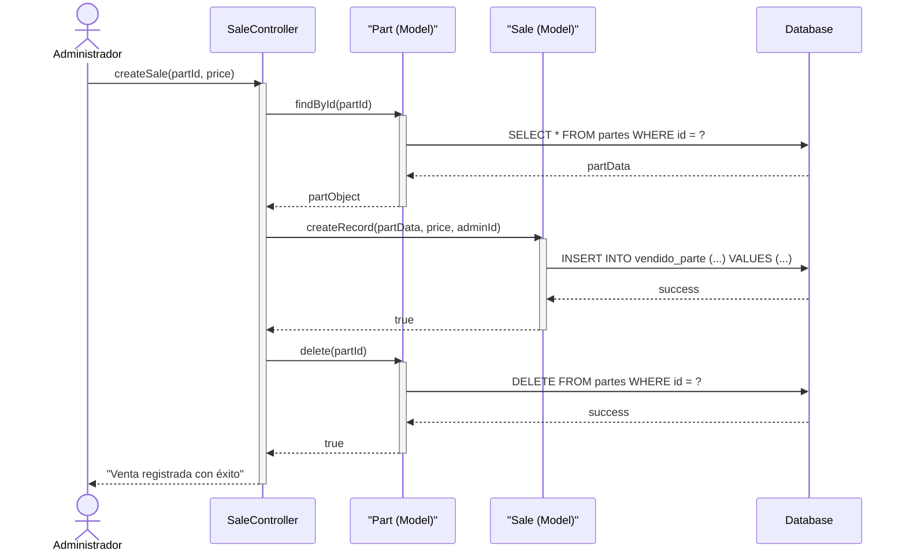

# Documentación del Proyecto: Sistema de Inventario o Rastro

**Versión:** 1.0
**Fecha:** 01 de Diciembre de 2025
**Autor:** Asistente Gemini (Arquitecto de Software)

---

## 1. Introducción

Este documento detalla la arquitectura, diseño y requisitos del "Sistema de Inventario o Rastro". El objetivo es construir una aplicación web modular, robusta y escalable utilizando PHP nativo, siguiendo el patrón MVC y preparándola para una futura migración a un entorno Docker.

---

## 2. Arquitectura del Sistema

-   **Patrón de Diseño:** Modelo-Vista-Controlador (MVC).
-   **Enfoque de Programación:** Orientada a Objetos (POO).
-   **Estructura de Archivos:** El sistema se organiza en carpetas dedicadas para `public` (front-controller, assets), `src` (lógica de negocio, controladores, modelos), `views` (plantillas), `config` (configuración) y `database` (scripts SQL).

---

## 3. Diagramas UML

Esta sección contiene los diagramas UML que modelan el sistema desde diferentes perspectivas.

### 3.1. Diagrama de Casos de Uso

El siguiente diagrama ilustra las interacciones de los usuarios (actores) con el sistema y las funcionalidades principales.

**Descripción de Actores:**
-   **Visitante:** Cualquier usuario público que navega por el sitio. No requiere autenticación para las funciones básicas de consulta.
-   **Administrador:** Un usuario autenticado con privilegios elevados para gestionar todos los aspectos del sistema.

---

*(Las siguientes secciones se completarán progresivamente)*

### 3.2. Diagrama de Clases

Este diagrama detalla la estructura estática del sistema. Define las clases, sus atributos, métodos y las relaciones entre ellas, sirviendo como un plano para la implementación del código.

### 3.3. Diagrama de Secuencia: Realizar Venta

Este diagrama muestra la secuencia de interacciones entre los objetos del sistema durante el proceso de venta de una parte. Este es un flujo de trabajo crítico que demuestra el patrón MVC en acción.

